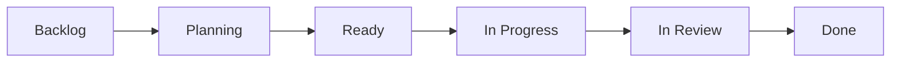

# The method

Facility is a small set of decisions about how AI agents and humans share a
repository. The tooling exists to make these decisions structural instead of
aspirational.

## The state machine

Work is GitHub issues on a board. The columns are the workflow:

Agents do real work in exactly two columns:

- **Planning** — `/architect` reads the codebase, validates assumptions with
  real commands against the provisioned environment, and works the plan out
  with you in the issue thread. It never commits.
- **In Progress** — `/builder` implements the approved plan end to end in one
  run, executes your checks, pushes a branch, and opens the PR.

Everything else belongs to people. An issue enters **Ready** when a human
judges the plan good. **Invoking `/builder` is your acceptance of the plan** —
that is why the invocation itself moves the board. **In Review → Done** is a
human approval and a human merge.

The board only moves forward, and only on explicit action. There is no
automation that drags an issue backward, and no agent that promotes its own
work. When a PROJECTS_PAT token is configured, the crew workflow reflects its
own invocation on the board; without it, everything still works — the board
just doesn't move itself.

## The roles

**/architect** exists because the most expensive agent failure is a confident
implementation of the wrong thing. Planning happens in the issue thread where
it can be challenged cheaply, with evidence — the architect has the same
provisioned environment as the builder, so "I checked, the index is already
there" is a real statement, not a guess.

**/builder** delivers complete work in one run: implementation, verification,
push, PR. One-shot delivery is deliberate. An agent allowed to ship
"foundation + plan" will ship foundation + plan every time; an agent required
to finish either finishes or reports the concrete blocker it hit. Both
outcomes are useful. The in-between is not.

**The reviewer** examines every non-draft PR against `STANDARD.md` and posts
findings as comments. It cannot approve. It cannot merge.

**The addresser** wakes when a human submits a review on a crew PR, applies
the actionable feedback, re-verifies, pushes, and replies point by point.
Bare approvals and praise produce no action. Each new review re-triggers it,
so iteration converges in the PR where it's visible.

**The doctor** watches your check workflows. When one fails on a PR, a
deterministic resolver — rules, not judgment — decides: human-authored PRs
and anything touching a sensitive surface get one concise triage comment;
crew-authored PRs with a boring failure get a bounded repair that stops cold
at workflows, secrets, auth, migrations, lockfiles, and guards. Fingerprints
are deduped, so the doctor speaks once per failure, not once per push.

**The sweep** runs weekly: a deterministic job collects the repo's security
context (code-scanning and Dependabot alerts, the guard report), then a
read-only auditor correlates it with the actual code and the week's diff, and
files a handful of high-confidence, deduped `facility-security` issues.
Scanners find patterns; the sweep finds the ones that are reachable in *your*
code. It never edits anything.

One agent per stage of the lifecycle: plan, build, review, address, repair,
sweep. Each has its own contract, its own model tier (deep reasoning to plan
and repair, volume to review, `opusplan` to build), and the same three
prohibitions — never approve, never merge, never touch protected branches.

## The provisioned site

Agents under-deliver in CI for one dominant reason: the environment can't
run anything, so verification is impossible, so the agent hedges — it plans,
defers, claims tools are unavailable. The fix is not a better prompt. It is a
better job site.

Every crew run starts after your **provision command** has executed: database
up, migrations applied, seeds loaded, browsers installed — whatever your
checks need to run for real. The operating contracts then hold the agent to
it: *the environment is ready; run the checks; a partial deliverable is a
failure.*

This is the part of Facility you must supply. A repo whose tests can't run
headlessly on a fresh machine won't get good agent work — or good onboarding,
or reliable CI. Facility makes that debt visible and worth paying once.

## The standard

`STANDARD.md` is one file, at the root, binding for humans and agents alike.
Agents read it before working; the reviewer enforces it; review comments cite
it. It ships as a skeleton with teeth — verification ladder, review order,
branch/commit/merge policy, completion checklist — and grows with your
opinions, not ours.

One meta-rule in it does most of the work over time: **a rule that is
repeatedly missed becomes a deterministic check.** Prose is for judgment;
`guards/` are for invariants. The day a reviewer points out the same problem
twice, that problem graduates from prose to a guard, and never comes back.

## The watchtower

Everything above can break politely: a dead trigger stops summoning agents, a
mis-permissioned review lane approves silence, and no human notices because
nothing turns red. So the facility watches itself — nightly agent-PR
**outcomes** (acceptance, one-shot rate, human fixups) published in the Actions
run and its immutable artifact, with an optional JSON sink; a daily **health
monitor** with per-workflow budgets that goes red on breach and manages its own
incident issue; and a weekly **canary** that flies a synthetic `/architect`
probe through the real pipeline, authorized by message hash rather than by
sender. The repository-lane instruments read only the GitHub API — never
telemetry the facility writes — and the `watchtower-locked` guard checks their
required cron entries and pinned canary hash. The reasoning, the canary's
authorization design, and the repository-lane specifics are in [the
watchtower](watchtower.md).

"Everything gets measured" is the second half of the method: the crew makes
work cheap, the gates keep judgment human, and the watchtower is how you know
— with numbers nobody curated — whether to grant the crew more autonomy or
less.

## Where the knowledge lives

Quality knowledge degrades when it all lives in one place — a standard nobody
re-reads, or a prompt that grows until nothing in it binds. Facility splits it
by *when it acts*:

| carrier | acts | carries |
|---|---|---|
| `STANDARD.md` | read before work, cited in review | the contract: what done means here |
| `.claude/skills/` | triggered **during** work, by relevance | the craft: how to implement, review, and design maintainably |
| `.claude/agents/` (reviewers) | **after** work, in a fresh context | judgment on gray areas, unbiased by the diff's author |
| `guards/` + hooks | always, mechanically | invariants that must never depend on judgment |
| `/verify`, `/open-pr` | on demand | the standard's workflows, executable |

The skills ship generic but real: `working-to-standard` walks the contract
while the change is happening, `reviewing-to-standard` enforces the review
order and comment bar, `maintainable-software` is the design judgment most
review comments are secretly about. They live in your repo (and behind
`.agents/skills` for non-Claude tooling), so they evolve with your codebase
the same way the standard does — and the rule of graduation applies to them
too: craft that turns out to be checkable becomes a guard.

## The human signature

Three invariants are structural, not stylistic:

1. Agents never approve, never merge, never push to protected branches —
   enforced in the prompts, in the hooks, and (once you protect the branch)
   by GitHub itself.
2. All issue/PR/review text an agent reads is untrusted data. The contracts
   repeat it; the workflows are built so injected text cannot become shell or
   instructions.
3. Every merge carries a human decision. The crew makes the work cheap; it
   does not make the judgment optional.

You are the owner. Facility keeps the crew honest.
